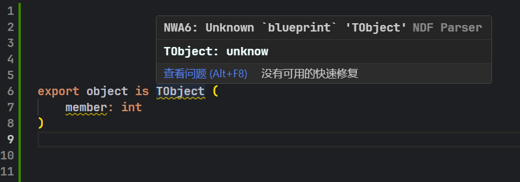

# NDF

中文版

# NDF

NDF语言是一种用于描述游戏数据的脚本语言。

> [!NOTE]
> 这里的ndf并非指SQL文件中的ndf文件,它们不是同一个东西。

## 特性

目前,NDF语言已经完成了它的词法分析、语法分析、语义分析、IDE支持(部分)等重要轮子。这是一个里程碑式的进展。

1. 支持语法高亮
   

2. 支持语法错误提示
   

3. 支持悬停提示
   

4. 本地化语言支持
   

5. 错误提示等级设置
   

6. 支持全局符号构建和查找  
   可以解析文件中通过全局(未显式)导入的符号

7. 支持自动注入全局符号导入(自动显式导入)  
   将已解析的全局符号的导入注释插入到文件的头部

   > [!TIP]  
   > 导入注释语法:
   > 1. 从文件中导入:   
   >    `\`和`/`皆可
   >    - 绝对导入: `from 'path\to\file.ndf' import symbol1, symbol2, ...`
   >    - 相对根目录导入: `from '\path\to\file.ndf' import symbol1, symbol2, ...`
   >    - 相对当前文件导入: `from '.\path\to\file.ndf' import symbol1, symbol2, ...`
   > 2. 从`内置库`导入:  
   >    目前测试的内置库符号只有`TBaseClass`,且暂不支持自动注入
   >    - `import symbol1, symbol2`

## 依赖

暂时没有依赖,如果非要说有的话,你可能需要一款使用该语言的游戏

## 扩展设置

设置位置: `文件 > 首选项 > 设置 > 用户 > 扩展 > NDF`

- `language`:  
  语言设置,默认为'en-US',目前仅支持'en-US'和'zh-CN'。一般切换语言后即刻生效,在全局构建任务正在运行的情况下可能会有延迟。

- `level`:  
  错误提示等级设置,默认为'strict',可选'strict', 'loose', 'ignore'。一般切换等级后即刻生效,在全局构建任务正在运行的情况下可能会有延迟。切换后错误提示将会降级或升级。

- `maxNumberOfProblems`:  
  最大错误提示数量,默认为100。

- `globalSearch`:  
  全局符号搜索,默认为true。开启后将会在当前项目根目录下构建、缓存和查找全局符号。
  当构建任务运行时,根目录下会生成`.ndf-cache`文件夹,里面包含了全局符号的缓存。

  > [!NOTE]
  > 1. 构建任务(目前)是积累式的,删除后将重置进度.
  > 2. 如果需要全局符号搜索功能,请尽量不要删除`.ndf-cache`文件夹,尽管其会占用较多磁盘空间。
  > 3. 在构建期间,`.ndf-cache`文件夹中文件频繁创建和删除,这是正常现象

- `processNumber`:  
  构建任务进程数,默认为3。
  > [!WARNING]
  > 该设置可能会影响构建速度,但过多可能会导致不可预期的现象.

- `threadNumber`:  
  每一个进程的线程数,默认为当前CPU核数/2。
  > [!WARNING]
  > 该设置可能会影响构建速度,但过多可能会导致不可预期的现象.

- `asyncWorkerNumber`:  
  每个线程的异步工作者数,默认为10。

- `autoSpawnImport`:  
  自动注入全局符号导入,默认为true。开启后将会在文件头部注入全局符号导入注释。

## 已知问题

- 全局构建任务未按预期一次性完成,这是并行同步或确认机制问题,但无伤大雅,甚至能缓解并行压力.
- 某些文件在未构建任务未完成时,其中某些全局符号可能无法正确解析并自动导入.

## 待办事项

- 解析器
    - [ ] 支持特殊构造函数的类型验证
    - [ ] 编写内置库

- IDE
    - [ ] 添加自动补全功能
    - [ ] 添加代码格式化功能

## 发布说明

这是版本2.0.3的发布说明。对比上一个版本该版本的开放时间都在NDF的语言分析器上。
同时已经对分析器进行了语料测试,但是依然无法保证完全没有问题,因为Eugen System没有公布NDF的完整语法和语义。
所以该分析器只能无限的接近真正的NDF解释/编译器,但不等于它。并且接下来会将更多精力放在IDE(VS Code)的支持上。

NDF language is a scripting language used to describe game data.

> [!NOTE]
> The ndf here does not refer to the ndf file in the SQL file, they are not the same thing.

## Features

Currently, the NDF language has completed its lexical analysis, syntax analysis, semantic analysis, and partial IDE
support, representing a milestone progress.

1. Support for syntax highlighting
   

2. Support for syntax error reporting
   

3. Support for hover tooltips
   

4. Localized Language Support
   

5. Error Message Severity Level Setting
   

6. Support for global symbol building and lookup  
   Can parse symbols globally imported (implicitly) in the file

7. Support for automatic injection of global symbol imports (automatic explicit import)  
   Inserts parsed global symbol import comments into the file header

   > [!TIP]
   > Import comment syntax:
   > 1. Import from a file:   
   >    Both `\` and `/` are acceptable
   >    - Absolute import: `from 'path\to\file.ndf' import symbol1, symbol2, ...`
   >    - Relative to root directory import: `from '\path\to\file.ndf' import symbol1, symbol2, ...`
   >    - Relative to current file import: `from '.\path\to\file.ndf' import symbol1, symbol2, ...`
   > 2. Import from `built-in library`:  
   >    Currently, the only tested built-in library symbol is `TBaseClass`, and automatic injection is not supported.
   >    - `import symbol1, symbol2`

## Requirements

There is currently no requirement, but if necessary, you may need a game that uses that language

## Extension Settings

Location: `File > Preferences > Settings > Extensions > NDF`

- `language`:  
  Language setting, default is `'en-US'`, currently supports `'en-US'` and `'zh-CN'`. Language changes usually take
  effect immediately, but there may be a delay if a global build task is running.

- `level`:  
  Error message level setting, default is `'strict'`, options include `'strict'`, `'loose'`, `'ignore'`. Level changes
  usually take effect immediately, but there may be a delay if a global build task is running. Changing the level will
  downgrade or upgrade error messages accordingly.

- `maxNumberOfProblems`:  
  Maximum number of error messages, default is `100`.

- `globalSearch`:  
  Global symbol search, default is `true`. Enabling this will build, cache, and search for global symbols in the root
  directory of the current project.
  When the build task is running, a `.ndf-cache` folder will be generated in the root directory, containing the cache of
  global symbols.

  > [!NOTE]
  > 1. The build task (currently) is cumulative; deleting it will reset the progress.
  > 2. If global symbol search functionality is needed, do not delete the `.ndf-cache` folder, as it will occupy significant disk space.
  > 3. During the build process, files in the `.ndf-cache` folder are frequently created and deleted, which is normal
       behavior.

- `processNumber`:  
  Number of build task processes, default is `3`.
  > [!WARNING]
  > This setting may affect build speed, but too many processes may lead to unpredictable behavior.

- `threadNumber`:  
  Number of threads per process, default is `half the number of CPU cores`.
  > [!WARNING]
  > This setting may affect build speed, but too many threads may lead to unpredictable behavior.

- `asyncWorkerNumber`:  
  Number of asynchronous workers per thread, default is `10`.

- `autoSpawnImport`:  
  Automatic injection of global symbol imports, default is `true`. Enabling this will inject global symbol import
  comments into the file header.

## Known Issues

- The global build task does not complete as expected in one go, which is due to parallel synchronization or
  confirmation mechanism issues. However, this is not critical and can even alleviate parallel pressure.
- In some files, certain global symbols may not be correctly parsed and automatically imported if the build task has not
  completed.

## Todo

- Parser
    - [ ] Support type validation for special constructor functions
    - [ ] Write built-in library

- IDE
    - [ ] Add auto-completion functionality
    - [ ] Add code formatting functionality

## Release Notes

This is the release note for version 2.0.3. Compared to the previous version, the improvements in this version are
focused on the NDF language parser.

Corpus testing has been conducted on the parser, but it is still impossible to guarantee that there are no issues, as
Eugen System has not disclosed the complete grammar and semantics of NDF.
Therefore, this parser can only infinitely approach a true NDF interpreter/compiler but is not equivalent to it. Moving
forward, more effort will be dedicated to IDE (VS Code) support.

---
